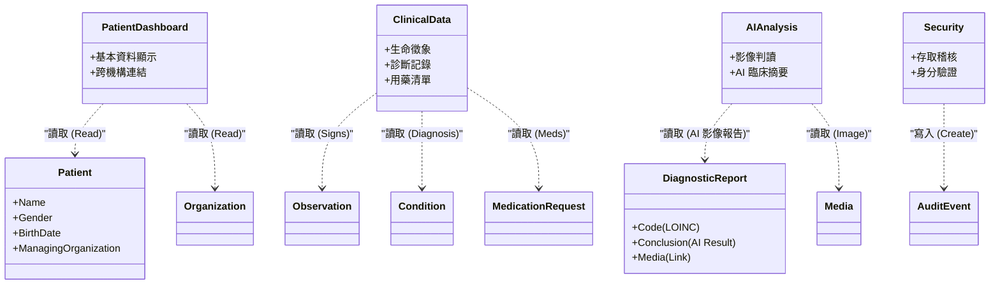
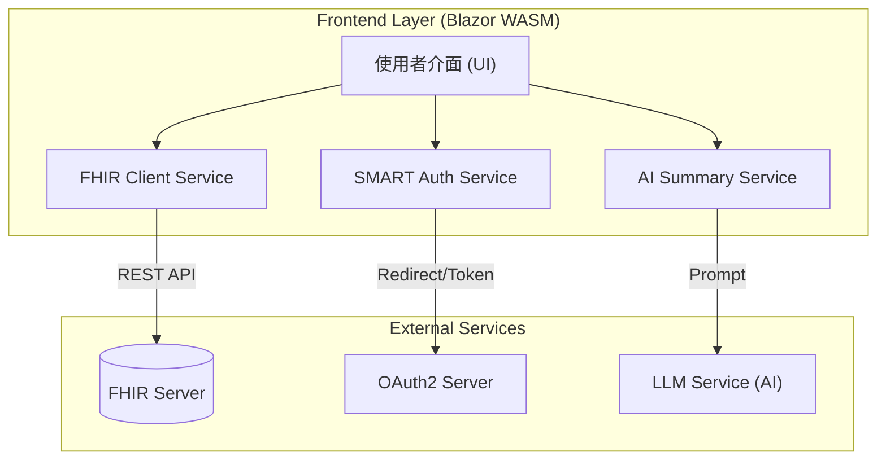
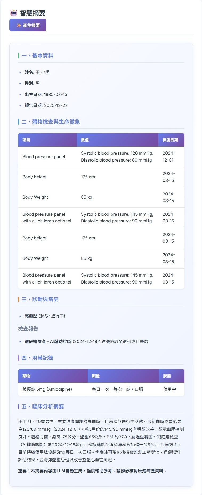
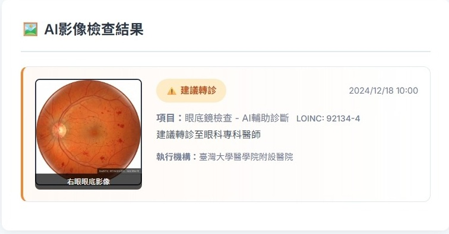
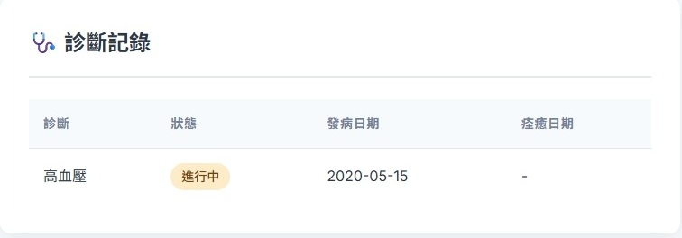
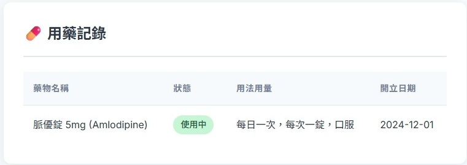
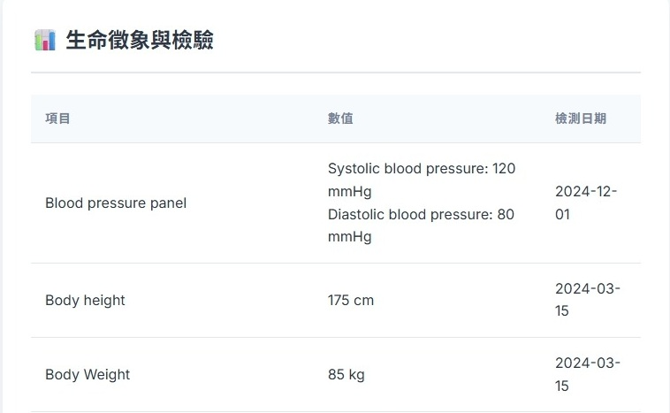
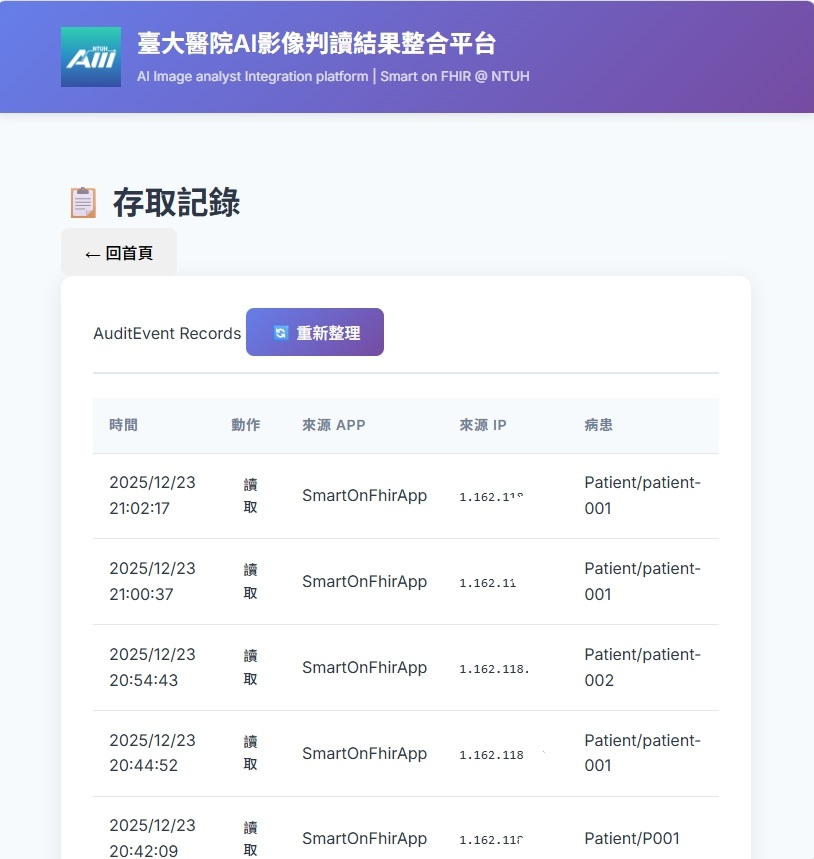
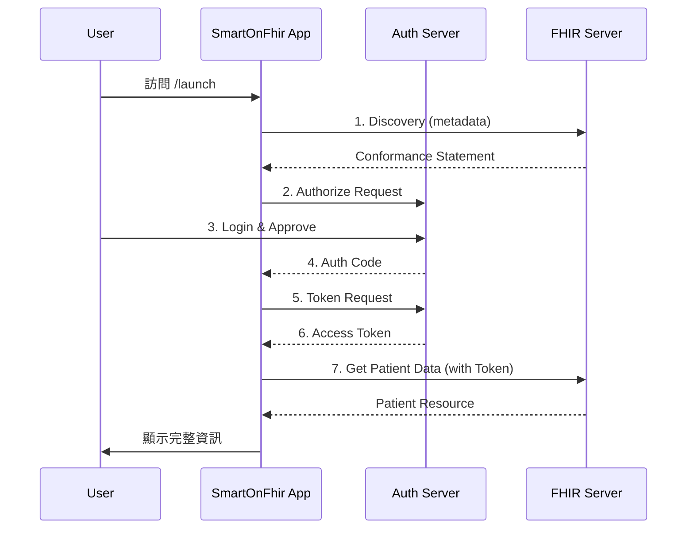

# 臺大醫院 AI 影像判讀結果整合平台 (AI Image analyst Integration platform | Smart on FHIR @ NTUH)

### 🏥 專案緣起：打造無圍牆的智慧醫療共享平台

長期以來，大型醫學中心與基層診所之間存在巨大的醫療資源落差。醫學中心擁有最先進的檢查儀器與 AI 輔助診斷模型，但這些資源往往難以普及至第一線的社區診所。這導致病患往往需要舟車勞頓前往大醫院，才能享有高品質的診斷服務。

**本專案的核心願景，即是「弭平醫療差距，用 FHIR 賦能基層」。**

我們利用 **SMART on FHIR** 國際標準作為溝通橋樑，將醫學中心成熟的 **AI 影像判讀模型**（如：眼底鏡分析報告）透過標準化介面分享給合作的基層診所。診所醫師無需投入高昂成本建置運算設備，僅需透過此輕量化平台，即可即時取得醫學中心等級的 AI 輔助判讀建議。

這不僅落實了資源共享，更協助醫師進行快速篩檢與分級醫療，讓每一位社區民眾，都能就近享有頂尖的智慧醫療照護。

---

這是一個基於 **Blazor WebAssembly (.NET 8)** 開發的應用程式，提供清晰的介面展示 AI 影像判讀結果並整合臨床資訊。本專案支援 **衛福部 SMART on FHIR 測試環境**，並符合 TW Core IG 規範。

## 📊 系統架構與 FHIR 資源整合 (Architecture & Resources)

本應用程式透過標準 FHIR API 存取醫療資料，並整合後端 AI 服務進行臨床分析。

### 1. 核心功能與 FHIR 資源對照 (Functionality vs. Resources)

下圖展示了應用程式各個功能模組所使用的具體 FHIR Resource：



### 2. 資料流架構 (Architecture Overview)



---

## � 系統介面展示 (System Screenshots)

### 1. 病患選擇與搜尋
透過標準 FHIR API 取得病患清單，支援跨機構篩選與關鍵字搜尋。


### 2. 智慧摘要與臨床整合
自動彙整病患的所有 FHIR 數據，並透過 AI 生成臨床分析摘要。


### 3. AI 影像判讀結果
整合眼底鏡等影像資料，顯示 AI 判讀結論與建議。


---

## 🚀 主要功能詳解

### 1. 病患儀表板 (Patient Dashboard)
- **FHIR Resource**: `Patient`, `Organization`
- **功能**: 
  - 顯示病患基本資料（姓名、性別、年齡、病歷號）。
  - **跨機構醫院選擇**：透過 `Organization` resource 支援切換不同就醫機構。
  - **RWD 設計**：支援手機與桌面版面自動切換。

### 2. AI 影像檢查結果 (AI Image Analysis)
- **FHIR Resource**: `DiagnosticReport`, `Media`
- **關鍵代碼**: 支援多種 LOINC 影像代碼 (如：`92134-4` 眼底鏡)
- **功能**:
  - 自動篩選 AI 影像檢查報告。
  - 顯示檢查項目的 LOINC 代碼與名稱。
  - 透過 `Media` resource 載入高解析度影像。
  - 顯示 AI 判讀結論（如：糖尿病視網膜病變嚴重程度）。
  - **互動式檢視**：支援點擊放大預覽影像。

### 3. 臨床數據整合 (Clinical Data)
- **FHIR Resource**:
  - `Observation`: 生命徵象數據（如體溫、血壓）。
  - `Condition`: 過去與現在的診斷記錄。
  - `MedicationRequest`: 門診/住院用藥清單。
- **功能**: 將散落的臨床數據彙整為表格，方便醫師快速瀏覽。




### 4. 智慧摘要 (AI Summary)
- **技術**: 大型語言模型 LLM
- **功能**: 
  - 一鍵生成「分析摘要」。
  - 自動統整上述所有 FHIR 數據，生成約 100-300 字的專業摘要，輔助決策。
  


### 5. 安全與稽核 (Security & Audit)
- **FHIR Resource**: `AuditEvent`
- **功能**:
  - **IP 追蹤**：自動記錄客戶端 IP 位址。
  - **Action Logging**：每次讀取病患資料時，自動向 FHIR Server 寫入一筆 `AuditEvent`，確保符合資安規範。


---

## 🛠️ 啟動與測試 (Getting Started)

### 前置需求
- .NET 8.0 SDK

### 1. 資料準備 (Optional)
若您使用的是空的 FHIR Server，請先執行匯入腳本：
```powershell
cd fhir-test-data
.\import-data.ps1
```

### 2. 啟動應用程式
```bash
cd SmartOnFhirApp
dotnet run
```
瀏覽器開啟：`https://localhost:5001`

### 3. SMART Launch 流程



---

## 🌐 部署指南 (Deployment)

本專案可部署為純靜態網站 (Static Web App)。

1. **發布**:
   ```bash
   dotnet publish -c Release -o output
   ```
2. **部署**: 將 `output/wwwroot` 目錄內容上傳至 GitHub Pages 或任何靜態主機。

---

## 📚 文件資源
- **[測試環境使用說明](docs/衛福部測試環境使用說明.md)**
- **[上架流程規範](docs/1014_SMART測試環境與上架流程_時賦.md)**

**License**: 本專案授權需經由國立臺灣大學醫學院附設醫院（臺大醫院）同意方可使用。
**Version**: 1.0
