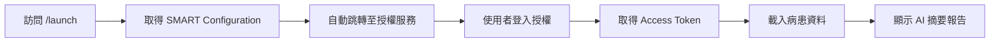
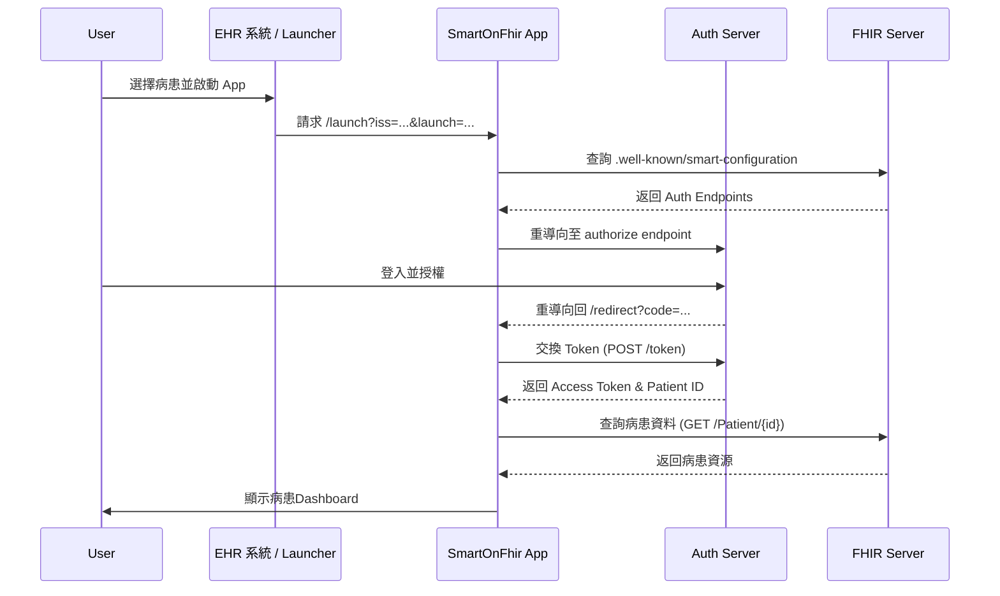

# 臺大醫院AI影像判讀結果整合平台 (SMART on FHIR)

這個專案是一個完整的 SMART on FHIR 應用程式實作，使用 **Blazor WebAssembly (.NET 8)** 開發，支援衛福部 SMART on FHIR 測試環境，並整合 AI 臨床摘要功能。

## 🚀 快速開始

### 先決條件

- **.NET 8.0 SDK** (LTS 版本)
- FHIR R4 相容的 FHIR Server (或使用公開 Sandbox)

### 步驟 0: 資料準備 (Data Preparation)

本專案提供了一鍵式腳本，用於將測試病患、機構、生命徵象與眼底鏡影像資料匯入至 FHIR Server。

1. **進入資料目錄**：
   ```powershell
   cd fhir-test-data
   ```

2. **執行匯入腳本**：
   ```powershell
   .\import-data.ps1
   ```
   > 此腳本會自動建立「臺灣大學醫學院附設醫院」、5 位測試病患，以及相關的生命徵象與眼底鏡檢查報告。

### 📋 測試資料概覽 (Test Data Overview)

以下為匯入的 5 筆測試病患資料及其眼底鏡檢查狀態：

| ID | 姓名 | 性別 | 年齡 | 眼底鏡檢查結果 | AI 建議 |
| :--- | :--- | :--- | :--- | :--- | :--- |
| **patient-001** | 王小明 | 男 | 40 | 糖尿病視網膜病變 (DR) | ⚠️ 建議轉診 |
| **patient-002** | 李美華 | 女 | 35 | 正常 | ✅ 無需轉診 |
| **patient-003** | 陳建國 | 男 | 47 | 嚴重糖尿病視網膜病變 | 🚨 **緊急轉診** |
| **patient-004** | 林淑芬 | 女 | 30 | 輕微白內障 | 📅 追蹤觀察 |
| **patient-005** | 張志偉 | 男 | 43 | 正常 | ✅ 無需轉診 |

---

### 步驟 1: 啟動應用程式

```bash
cd SmartOnFhirApp
dotnet run
```
應用程式將會在 `https://localhost:5001` (或 `http://localhost:5000`) 啟動。

## 📊 流程圖示 (Process Flows)

### 1. SMART Launch 流程概覽



### 2. SMART EHR Launch 啟動序 (Technical Flow)



### 步驟 2: 啟動 SMART Launch

1. 瀏覽器開啟：`https://localhost:5001/launch`
2. 系統會**自動跳轉**到衛福部測試環境的登入頁面 (`thas.mohw.gov.tw/provider-login`)
3. 使用測試帳號登入並選擇病患進行授權
4. 完成授權後，網頁將顯示病患的詳細資料與 AI 摘要報告

> [!TIP]
> 測試環境帳號請參考 [衛福部測試環境使用說明](docs/衛福部測試環境使用說明.md)

### 💡 操作說明 (User Guide)

#### 1. 醫院篩選與病患搜尋
- 在病患選擇頁面，使用左上角的 **下拉選單** 選擇醫院（預設顯示「臺灣大學醫學院附設醫院」）。
- 輸入病患姓名或 ID 進行搜尋。

#### 2. 檢視眼底鏡報告
- 在病患儀表板中，找到 **"👁️ AI眼底鏡檢查結果"** 卡片。
- 卡片顯示 AI 判讀結果（如：建議轉診、無需轉診）與執行機構。
- **點擊眼底影像** 可開啟放大檢視模式，再次點擊即可關閉。

#### 3. 智慧摘要
- 點擊 **"✨ 產生摘要"** 按鈕。
- 系統將整合病患的診斷、用藥、檢驗與檢查報告，生成一份完整的病歷摘要。

---

## 🌐 部署指南

本專案為 **Blazor WebAssembly** 應用程式，可部署為純靜態網站：

1. **發布**：
   ```bash
   dotnet publish -c Release
   ```
2. **部署**：將 `/bin/Release/net8.0/wwwroot` 資料夾部署至 GitHub Pages、Azure Static Web Apps 或任何靜態網站主機。

> [!NOTE]
> 本專案使用 GitHub Actions 自動部署到 GitHub Pages，請參考 `.github/workflows/deploy.yml`。

---

## 📚 相關文件 (docs/)

本專案 `docs/` 資料夾中包含重要參考文件：

- 📖 **[1014_SMART測試環境與上架流程_時賦.md](docs/1014_SMART測試環境與上架流程_時賦.md)**  
  詳細的 SMART on FHIR 上架規範與測試環境參數說明。

- 📖 **[衛福部測試環境使用說明.md](docs/衛福部測試環境使用說明.md)**  
  針對衛福部 Sandbox 的具體操作指南。

- 📖 **[衛生福利部資訊處三大類型智慧醫療中心技術手冊_v20250512.md](docs/衛生福利部資訊處三大類型智慧醫療中心技術手冊_v20250512.md)**  
  官方技術手冊與規範。

---

## 🏗️ 專案結構

```
SmartOnFhir/
├── SmartOnFhirApp/           # 主要應用程式 (Blazor WebAssembly)
│   ├── Pages/                # Razor 頁面 (Index.razor, Launch.razor, Redirect.razor)
│   ├── Services/             # FHIR 服務、AI 摘要服務、AuditEvent 記錄
│   ├── Models/               # FHIR 資料模型 (Patient, Observation, AuditEvent 等)
│   ├── wwwroot/              # 靜態檔案 (css, appsettings.json)
│   └── SmartOnFhirApp.csproj # 專案檔 (.NET 8)
├── docs/                     # 說明文件與規範
├── fhir-test-data/           # 測試資料 JSON 與匯入腳本 (詳見 fhir-test-data/README.md)
└── README.md                 # 本文件
```

---

## 🔧 常見問題與疑難排解


### Q: 發生 HTTPS 憑證錯誤？
**A:** 本地開發環境 (localhost) 的憑證通常未經簽署，請在瀏覽器中選擇「繼續前往」或「接受風險」即可。

---

**授權**: MIT License  
**版本**: 4.0 (Blazor WebAssembly - .NET 8 LTS with AI Integration)
