# 臺大醫院 AI 影像判讀結果整合平台 (SMART on FHIR)

為了彌平大醫院跟小診所之間的醫療設備差距，本專案旨在透過 SMART on FHIR 機制，將大醫院的先進 AI 影像判讀資源分享給基層診所使用。

這是一個基於 **Blazor WebAssembly (.NET 8)** 開發的應用程式，提供清晰的介面展示 AI 影像判讀結果並整合臨床資訊。本專案支援 **衛福部 SMART on FHIR 測試環境**，並符合 TW Core IG 規範。

## 📊 系統架構與 FHIR 資源整合 (Architecture & Resources)

本應用程式透過標準 FHIR API 存取醫療資料，並整合後端 AI 服務進行臨床分析。

### 1. 核心功能與 FHIR 資源對照 (Functionality vs. Resources)

下圖展示了應用程式各個功能模組所使用的具體 FHIR Resource：

```mermaid
classDiagram
    class PatientDashboard {
        +基本資料顯示
        +跨機構連結
    }
    class ClinicalData {
        +生命徵象
        +診斷記錄
        +用藥清單
    }
    class AIAnalysis {
        +影像判讀
        +AI 臨床摘要
    }
    class Security {
        +存取稽核
        +身分驗證
    }

    PatientDashboard ..> Patient : "讀取 (Read)"
    PatientDashboard ..> Organization : "讀取 (Read)"
    
    ClinicalData ..> Observation : "讀取 (Signs)"
    ClinicalData ..> Condition : "讀取 (Diagnosis)"
    ClinicalData ..> MedicationRequest : "讀取 (Meds)"
    
    AIAnalysis ..> DiagnosticReport : "讀取 (AI 影像報告)"
    AIAnalysis ..> Media : "讀取 (Image)"
    
    Security ..> AuditEvent : "寫入 (Create)"
    
    class Patient {
        +Name
        +Gender
        +BirthDate
        +ManagingOrganization
    }
    class DiagnosticReport {
        +Code (LOINC)
        +Conclusion (AI Result)
        +Media (Link)
    }
```



### 2. 資料流架構 (Architecture Overview)

```mermaid
graph TD
    subgraph "Frontend Layer (Blazor WASM)"
        UI["使用者介面 (UI)"]
        Auth["SMART Auth Service"]
        FhirClient["FHIR Client Service"]
        AiService["AI Summary Service"]
    end

    subgraph "External Services"
        FHIR[("FHIR Server")]
        AuthServer["OAuth2 Server"]
        LLM["LLM Service (AI)"]
    end

    UI --> Auth
    UI --> FhirClient
    UI --> AiService
    
    Auth --"Redirect/Token"--> AuthServer
    FhirClient --"REST API"--> FHIR
    AiService --"Prompt"--> LLM
```



---

## 🚀 主要功能詳解

### 1. 病患儀表板 (Patient Dashboard)
- **FHIR Resource**: `Patient`, `Organization`
- **功能**: 
  - 顯示病患基本資料（姓名、性別、年齡、病歷號）。
  - **跨機構醫院選擇**：透過 `Organization` resource 支援切換不同就醫機構。
  - **RWD 設計**：支援手機與桌面版面自動切換。

### 2. AI 影像檢查結果 (AI Image Analysis)
- **FHIR Resource**: `DiagnosticReport`, `Media`
- **關鍵代碼**: 支援多種 LOINC 影像代碼 (如：`92134-4` 眼底鏡)
- **功能**:
  - 自動篩選 AI 影像檢查報告。
  - 顯示檢查項目的 LOINC 代碼與名稱。
  - 透過 `Media` resource 載入高解析度影像。
  - 顯示 AI 判讀結論（如：DR 糖尿病視網膜病變嚴重程度）。
  - **互動式檢視**：支援點擊放大預覽影像。

### 3. 臨床數據整合 (Clinical Data)
- **FHIR Resource**:
  - `Observation`: 生命徵象數據（如體溫、血壓）。
  - `Condition`: 過去與現在的診斷記錄。
  - `MedicationRequest`: 門診/住院用藥清單。
- **功能**: 將散落的臨床數據彙整為表格，方便醫師快速瀏覽。

### 4. 智慧摘要 (AI Summary)
- **技術**: Semantic Kernel / LLM
- **功能**: 
  - 一鍵生成「分析摘要」。
  - 自動統整上述所有 FHIR 數據，生成約 100-300 字的專業摘要，輔助決策。

### 5. 安全與稽核 (Security & Audit)
- **FHIR Resource**: `AuditEvent`
- **功能**:
  - **IP 追蹤**：自動記錄客戶端 IP 位址。
  - **Action Logging**：每次讀取病患資料時，自動向 FHIR Server 寫入一筆 `AuditEvent`，確保符合資安規範。

---

## 🛠️ 啟動與測試 (Getting Started)

### 前置需求
- .NET 8.0 SDK

### 1. 資料準備 (Optional)
若您使用的是空的 FHIR Server，請先執行匯入腳本：
```powershell
cd fhir-test-data
.\import-data.ps1
```

### 2. 啟動應用程式
```bash
cd SmartOnFhirApp
dotnet run
```
瀏覽器開啟：`https://localhost:5001`

### 3. SMART Launch 流程

```mermaid
sequenceDiagram
    participant User
    participant App as SmartOnFhir App
    participant Auth as Auth Server
    participant FHIR as FHIR Server

    User->>App: 訪問 /launch
    App->>FHIR: 1. Discovery (metadata)
    FHIR-->>App: Conformance Statement
    App->>Auth: 2. Authorize Request
    User->>Auth: 3. Login & Approve
    Auth-->>App: 4. Auth Code
    App->>Auth: 5. Token Request
    Auth-->>App: 6. Access Token
    App->>FHIR: 7. Get Patient Data (with Token)
    FHIR-->>App: Patient Resource
    App->>User: 顯示完整資訊
```



---

## 🌐 部署指南 (Deployment)

本專案可部署為純靜態網站 (Static Web App)。

1. **發布**:
   ```bash
   dotnet publish -c Release -o output
   ```
2. **部署**: 將 `output/wwwroot` 目錄內容上傳至 GitHub Pages 或任何靜態主機。

---

## 📚 文件資源
- **[測試環境使用說明](docs/衛福部測試環境使用說明.md)**
- **[上架流程規範](docs/1014_SMART測試環境與上架流程_時賦.md)**

**License**: MIT  
**Version**: 1.0.2501
